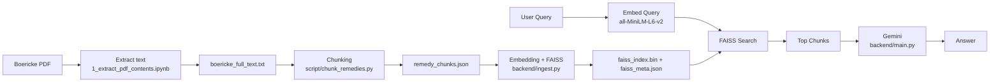
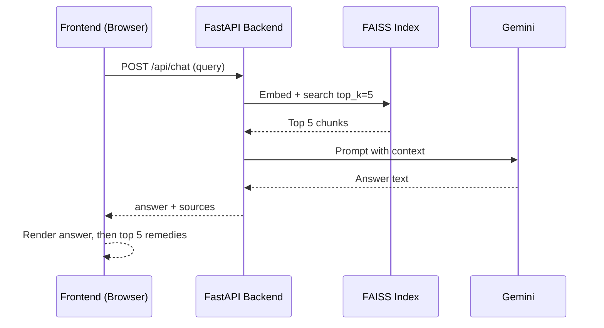

# Homeopathy RAG (FAISS + Gemini)

A homeopathy RAG system built on a local embedding model (`all-MiniLM-L6-v2`), FAISS vector search, and Gemini for answer generation. Document embeddings are generated once and saved to disk; only user queries are embedded at runtime.

**What's inside**
1. `data/Boericke_materia_medical.pdf` is the source.
2. `1_extract_pdf_contents.ipynb` extracts plain text to `data/boericke_full_text.txt`.
3. `script/chunk_remedies.py` creates `data/remedy_chunks.json`.
4. `backend/ingest.py` builds `data/faiss_index.bin` and `data/faiss_meta.json`.
5. `backend/main.py` serves search + chat APIs.
6. `frontend/` is a static UI.

**Key features**
1. One-time document embedding with FAISS persistence.
2. Local embeddings (`all-MiniLM-L6-v2`) for both ingestion and query vectors.
3. Gemini used only for final answer synthesis.

**Preprocessing flow**
1. PDF -> text: `1_extract_pdf_contents.ipynb` produces `data/boericke_full_text.txt`.
2. Text -> chunks: `script/chunk_remedies.py` produces `data/remedy_chunks.json`.
3. Chunks -> FAISS: `backend/ingest.py` produces `data/faiss_index.bin` and `data/faiss_meta.json`.

**Flow diagram**


**Runtime flow**


**Setup**
1. Install backend dependencies:
   ```
   python -m pip install -r backend/requirements.txt
   ```
2. Set environment variables in `.env`:
   ```
   GEMINI_API_KEY=your_key_here
   ```
   Gemini is required for `/api/chat` (the frontend uses chat by default).

**Run ingestion (one-time)**
1. Generate chunk file (only if not present):
   ```
   python script/chunk_remedies.py
   ```
2. Build FAISS index:
   ```
   python backend/ingest.py
   ```
   If `data/faiss_index.bin` and `data/faiss_meta.json` already exist, ingestion exits early.
   To force rebuild:
   ```
   set FAISS_FORCE_REBUILD=1
   python backend/ingest.py
   ```

**Run backend**
```
python -m uvicorn backend.main:app --reload --host 0.0.0.0 --port 8000
```

**Run frontend**
Open `frontend/index.html` directly in a browser, or serve it:
```
python -m http.server 5173 --directory frontend
```

**App behavior**
1. The frontend calls `/api/chat` and displays the Gemini answer first.
2. The top 5 similar remedies are shown below the answer.

**API endpoints**
1. `GET /` health check
2. `POST /api/search` semantic search
3. `POST /api/chat` RAG chat (requires `GEMINI_API_KEY`)
4. `GET /api/stats` index stats

**Notes**
1. Document embeddings are stored in `data/faiss_index.bin` and `data/faiss_meta.json`.
2. Only user queries are embedded at runtime.
3. If you update the source PDF or chunking logic, rebuild the FAISS index.
